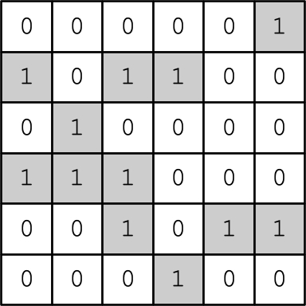
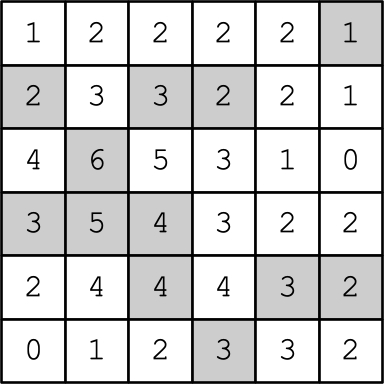
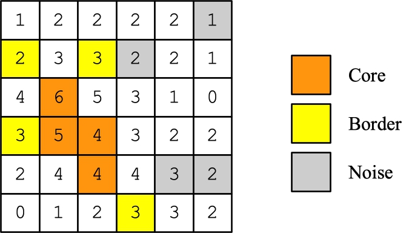
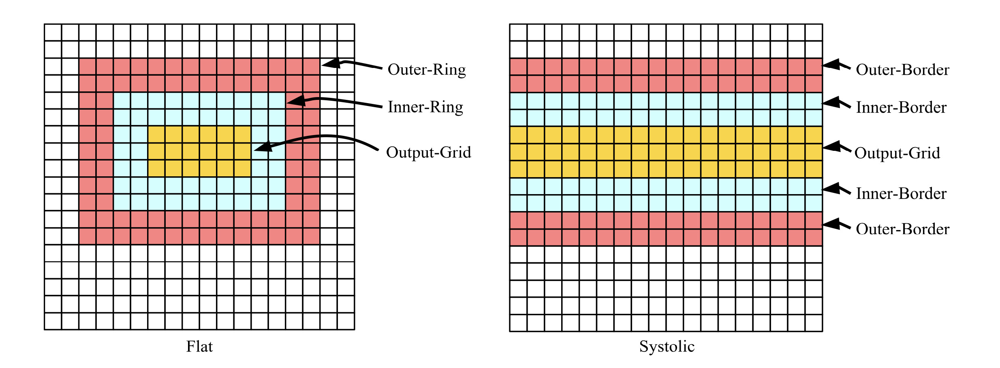

Code for executing and testing the DBSCAN algorithm neuromorphically.

Points of Contact: James S. Plank, Charles P. Rizzo

----------
# Information on the outputs of these programs

Although the outputs of the programs are specific to the TENNLab Neuromorphic Computing Framework,
it is a very simple matter to convert the outputs into whatever spiking neural network you desire
to work with.  We give a precise description of the output format below.

------------------------------
# The DBSCAN algorithm

The algorithm works on a grid of events, which are either *On* (1) or *Off* (0).
Here is an example of a 6x6 grid:



The algorithm is parameterized by *epsilon*, which you can think of as a radius,
and *minPts*, which is a measure of density.  You first count up all *On* events
within *epsilon* (by x or y) of each point.  Here's an example with *epsilon*
equal to one:




Now, each *On* event is given one of three labels:

- *Core:* It has a count of at least *minPts*.
- *Border:* It is not *Core*, but there is a *Core* event within *epsilon*.
- *Noise:* It is neither *Core* nor *Border*

Here is our grid using *minPts = 4*, with the *On* events labeled:



Here's a citation for the original DBSCAN paper:

```
author      M. Ester and H. P. Kriegel and J. Sander and X.  Xu
title       A density-based algorithm for discovering clusters in large spatial databases with noise
booktitle   KDD: Proceedings of the 2nd International Conference on Knowledge Discovery and Data Mining          
pages       226-231
month       August
year        1996
doi         10.5555/3001460.3001507
url         https://dl.acm.org/doi/10.5555/3001460.3001507
```

Here's a paper that uses DBSCAN to help filter noise and do object identification with
an event-based camera.  They did a neuromorphic implementation of a "speed" filter, but
they executed the DBSCAN non-neuromorphically.

```
author      M. Nagaraj and C. M. Liyanagedera and K. Roy
title       {DOTIE} - Detecting Objects through Temporal Isolation of Events using a Spiking Architecture
booktitle   IEEE International Conference on Robotics and Automation (ICRA)
month       May
year        2023
where       https://arxiv.org/pdf/2210.00975.pdf
```

The following paper was our first neuromorphic implementation of DBSCAN. It is the inspiration
of this work:

```
author        C. P. Rizzo and C. D. Schuman and J. S. Plank
title         Speed-based Filtration and {DBSCAN} of Event-based Camera Data with Neuromorphic Computing
year          2024
eprint        2401.15212
archivePrefix arXiv
url           https://arxiv.org/abs/2401.15212
```

The following paper provides the reference material for the implementation
in this repo.  Our nomenclature
and networks follow this description, and when we talk about "the paper" below,
this is the paper to which we are referring.

```
author        C. P. Rizzo and J. S. Plank
title         A Neuromorphic Implemenation of the {DBSCAN} Algorithm
year          2024
eprint        2409.14298
archivePrefix arXiv
url           https://arxiv.org/abs/2409.14298
howpublished  \url{https://arxiv.org/abs/2409.14298}
```

----------
# Programs in this directory

Many of them are in C++ and must be compiled:

```
UNIX> make clean
rm -f bin/*
UNIX> make
g++ -Wall -Wextra --pedantic -o bin/dbscan_flat_full src/dbscan_flat_full.cpp
g++ -Wall -Wextra --pedantic -o bin/dbscan_flat_partial src/dbscan_flat_partial.cpp
g++ -Wall -Wextra --pedantic -o bin/dbscan_systolic_full src/dbscan_systolic_full.cpp
g++ -Wall -Wextra --pedantic -o bin/dbscan_systolic_partial src/dbscan_systolic_partial.cpp
g++ -Wall -Wextra --pedantic -o bin/output_flat src/output_flat.cpp
g++ -Wall -Wextra --pedantic -o bin/output_systolic_full src/output_systolic_full.cpp
g++ -Wall -Wextra --pedantic -o bin/output_systolic_partial src/output_systolic_partial.cpp
g++ -Wall -Wextra --pedantic -o bin/create_spikes_full src/create_spikes_full.cpp
g++ -Wall -Wextra --pedantic -o bin/create_spikes_partial src/create_spikes_partial.cpp
g++ -Wall -Wextra --pedantic -Iinclude -std=c++11 -o bin/random_dbscan_full src/random_dbscan_full.cpp
g++ -Wall -Wextra --pedantic -Iinclude -std=c++11 -o bin/random_dbscan_partial src/random_dbscan_partial.cpp
g++ -Wall -Wextra --pedantic -o bin/dbscan src/dbscan.cpp
UNIX> 
```

----------
## src/dbscan.cpp

This implements dbscan non-neuromorphically.  It's not very efficient either, but we are just using
it for testing.

Call it as: 

```
bin/dbscan epsilon minpoints data_file I_R I_C sr sc
```

It will output the DBSCan of the I_RxI_C rectangle of the data file, starting with row SR and
column SC (zero indexed).  The data file is text -- 0's and 1's.
If SR+I_R or SC+I_C is too big, then the values are assumed to be zero.

Here's the example above:

```
UNIX> cat txt/example.txt 
000001
101100
010000
111000
001011
000100
UNIX> bin/dbscan 1 4 txt/example.txt 6 6 0 0          # This matches the example above
......
B.B...
.C....
BCC...
..C...
...B..
UNIX> bin/dbscan 1 4 txt/example.txt 2 2 0 0          # We isolate the upper-left 2x2 region
..
B.
UNIX> bin/dbscan 1 4 txt/example.txt 2 2 2 2          # Here's the center 2x2 region
..
C.
UNIX> bin/dbscan 1 4 txt/example.txt  8 20 0 0        # If you give it a region bigger than the data
....................                                  # then it simply pads the data with zeros.
B.B.................
.C..................
BCC.................
..C.................
...B................
....................
....................
UNIX> 
```

----------
## Outputs of the other src/dbscan_xxx programs

The outputs of these programs are commands for the `network_tool` program in the 
[TENNLab open-source software framework](https://github.com/TENNLab-UTK/framework-open).
In the examples below, I set the `$fr` environment variable in my shell to the open-source
framework, so if you want to follow along, then clone the framework and set your `$fr`
variable.  

If you are not using the framework, then here
a description of the commands that are output by these programs.  You should be able to interpret
these easily in whatever software you use for spiking neural networks.

- `FJ file`: This reads in a spiking neural network, which, in these outputs, is an empty one.
  However, in the TENNLab framework, the neural network file specifies the parameters for the
  neuroprocessor, which is why we emit this command.  If you are just wanting to create SNN's
  in your own format, just igore this line.

- `AN i`: This says "Add a neuron with id *i* to the neural network.  *i* is a number, and in these
  outputs, we create the neuron id's consecutively from zero.

- `AI i`: This says that neuron *i* is an input neuron.

- `AO i`: This says that neuron *i* is an output neuron.

- `SNP i Threshold j`: This says to set the threshhold of neuron *i* to *j*.

- `SETNAME i j`: This says to set the name of neuron *i* to *j*.  Names are optional, but we provide them to
  help you map the neural networks to the paper.

- `AE i j`: This says that to add a synapse from neuron *i* to neuron *j*.

- `SEP i j Delay k`: This says to set the delay of the synapse from *i* to *j* to *k*.
- `SEP i j Weight k`: This says to set the weight of the synapse from *i* to *j* to *k*.

- `SORT Q`: Ignore this -- the internal representation of our neural networks uses a hash table, but you
   can specify to sort the neurons and synapses, which makes the network files (which are JSON)
   more readable.
    
- `TJ`: This says to print the network on standard output.

----------
## src/dbscan_flat_full.cpp

This creates the `network_tool` commands for creating a RISP network to calculate 
dbscan from spikes.  It's called "FLAT" because it processes all of the input spikes
at once.  The networks are quite big: *5RC* neurons and *(3+2N)RC$ synapses, where
*N = (2epsilon+1)(2epsilon+1)-1*.
However, it pipelines
perfectly, so that you can process inputs on consecutive timesteps if you want.

This will create a network that reads *RC* input spikes, 
Each input spike has its own input neuron, and you spike all of them in at the same time.
There are *2(RC)* output neurons.  The first set are for core events -- each spikes
at timestep 2 if its corresponding input is a core event.  The second set
are for border events -- each spikes at timestep 4 if its corresponding 
input is a core event.

The exact specification of how this works is in the last paper cited above.  You use this
program in conjunction with `src/create_spikes_full.cpp`, and `src/output_flat.cpp`, which
are desribed directly below.

Here is how you use the program:

```
UNIX> bin/dbscan_flat_full
usage: bin/dbscan_flat_full R C epsilon minPts emptynet
UNIX> 
```

All of the parameters are straightforward, but you need to give it an empty RISP network that
it will build upon.  I have one in [networks/empty-risp-1-7.txt](networks/empty-risp-1-7.txt) --
it has synapse weights that are -1 or 1, and maximum neuron thresholds of 7:

```
UNIX> cat networks/empty-risp-1-7.txt
{ "Properties":
  { "node_properties": [
      { "name":"Threshold", "type":73, "index":0, "size":1, "min_value":1.0, "max_value":7.0 }],
    "edge_properties": [
      { "name":"Delay", "type":73, "index":1, "size":1, "min_value":1.0, "max_value":15.0 },
      { "name":"Weight", "type":73, "index":0, "size":1, "min_value":-1.0, "max_value":1.0 }],
    "network_properties": [] },
 "Nodes": [],
 "Edges": [],
 "Inputs": [],
 "Outputs": [],
 "Network_Values": [],
 "Associated_Data":
   { "other": {"proc_name":"risp"},
     "proc_params": 
      { "discrete": true,
        "fire_like_ravens": false,
        "leak_mode": "all",
        "max_delay": 15,
        "max_threshold": 7.0,
        "max_weight": 1.0,
        "min_potential": 0.0,
        "min_threshold": 1.0,
        "min_weight": -1.0,
        "run_time_inclusive": false,
        "spike_value_factor": 1.0,
        "threshold_inclusive": true}}}
UNIX> 
```

Here is how to create the network that performs DBSCAN on the file in `txt/example.txt`.  First,
we create the `network_tool` commands to build the network:

```
UNIX> bin/dbscan_flat_full 6 6 1 4 networks/empty-risp-1-7.txt > tmp-commands.txt
UNIX> wc tmp-commands.txt
    2511    9901   38753 tmp-commands.txt        # It's a 2511-line file
UNIX> head tmp-commands.txt
FJ networks/empty-risp-1-7.txt                   # You can use the description above to figure out the output.
AN 0                                             # Or you can use TENNLab tools, which is what we'll do here.
AI 0
SNP 0 Threshold 1
SETNAME 0 I[0][0]
AN 1
AI 1
SNP 1 Threshold 1
SETNAME 1 I[0][1]
AN 2
UNIX> 
```

Then we use the `network_tool` from the framework to make the network (I set my `$fr` environment
variable to be the framework):

```
UNIX> ( cd $fr ; make bin/network_tool )
# This will compile the network tool in the framework
UNIX> $fr/bin/network_tool < tmp-commands.txt > tmp-network.txt         # Create the network.
UNIX> wc tmp-network.txt
    827     876   37750 tmp-network.txt                                 # It's a decent-sized file.
UNIX> ( echo FJ tmp-network.txt ; echo INFO ) | $fr/bin/network_tool
Please use "VIZ" option to visually see network if you have love installed

Nodes:        180
Edges:        620
Inputs:        36
Outputs:       72

Input nodes:  0(I[0][0]) 1(I[0][1]) 2(I[0][2])       ... # There are 36 of these, one for each input event.
Hidden nodes: 121(B[2][1]) 123(B[2][3]) 138(B[5][0]) ... # There are 72 of these: the C & B neurons in the paper.
Output nodes: 72(Core[0][0]) 73(Core[0][1])          ...  # There are 36 Core and 36 Border outputs
UNIX> 
```

----------
## src/create_spikes_full.cpp

Now, we want to turn our DBSCAN input file into spikes for this network.  To do that, we use
`bin/create_spikes_full`:

```
UNIX> bin/create_spikes_full
usage: bin/create_spikes_full FLAT|SYSTOLIC|SYSTOLIC_AS < file
UNIX> bin/create_spikes_full FLAT < txt/example.txt > tmp-spikes.txt
UNIX> cat tmp-spikes.txt
AS 5 0 1
AS 6 0 1
AS 8 0 1
AS 9 0 1
AS 13 0 1
AS 18 0 1
AS 19 0 1
AS 20 0 1
AS 26 0 1
AS 28 0 1
AS 29 0 1
AS 33 0 1
UNIX> 
```

This is all quite straightforward.  The `AS` commands are for the `processor_tool` -- basically, 
`AS id time val` says to queue an input spike for the neuron with the given *id* with the given
*val* at the given *time*.  With the flat algorithm, all of the spikes are applied at time zero.

------------------------------
### Running the network by hand

You can now run the network on the input using the `processor_tool` from the
open-source framework:

```
UNIX> ( cd $fr ; make bin/processor_tool_risp )
# This makes sure the processor_tool is compiled for risp.
UNIX> $fr/bin/processor_tool_risp
ML tmp-network.txt                    # Load the network, which also sets up the processor.
AS 5 0 1                              # Copy/paste the spikes from above.
AS 6 0 1
AS 8 0 1
AS 9 0 1
AS 13 0 1
AS 18 0 1
AS 19 0 1
AS 20 0 1
AS 26 0 1
AS 28 0 1
AS 29 0 1
AS 33 0 1
RUN 5                                          # Run for 5 timesteps.
OT                                             # Take a look at the outputs -- there are 35 Core
node 72(Core[0][0]) spike times:               # outputs and 36 Border outputs.
node 73(Core[0][1]) spike times:
node 74(Core[0][2]) spike times:
node 75(Core[0][3]) spike times:
node 76(Core[0][4]) spike times:
node 77(Core[0][5]) spike times:
node 78(Core[1][0]) spike times:
node 79(Core[1][1]) spike times:
node 80(Core[1][2]) spike times:
node 81(Core[1][3]) spike times:
node 82(Core[1][4]) spike times:
node 83(Core[1][5]) spike times:
node 84(Core[2][0]) spike times:
node 85(Core[2][1]) spike times: 2.0       # Where you see the spike at time 2, it's a core event.
node 86(Core[2][2]) spike times:
node 87(Core[2][3]) spike times:
node 88(Core[2][4]) spike times:
node 89(Core[2][5]) spike times:
node 90(Core[3][0]) spike times:
node 91(Core[3][1]) spike times: 2.0
node 92(Core[3][2]) spike times: 2.0
node 93(Core[3][3]) spike times:
node 94(Core[3][4]) spike times:
node 95(Core[3][5]) spike times:
node 96(Core[4][0]) spike times:
node 97(Core[4][1]) spike times:
node 98(Core[4][2]) spike times: 2.0
node 99(Core[4][3]) spike times:
node 100(Core[4][4]) spike times:
node 101(Core[4][5]) spike times:
node 102(Core[5][0]) spike times:
node 103(Core[5][1]) spike times:
node 104(Core[5][2]) spike times:
node 105(Core[5][3]) spike times:
node 106(Core[5][4]) spike times:
node 107(Core[5][5]) spike times:
node 144(Border[0][0]) spike times:
node 145(Border[0][1]) spike times:
node 146(Border[0][2]) spike times:
node 147(Border[0][3]) spike times:
node 148(Border[0][4]) spike times:
node 149(Border[0][5]) spike times:
node 150(Border[1][0]) spike times: 4.0       # Where you see the spike at time 4, it's a border event.
node 151(Border[1][1]) spike times:
node 152(Border[1][2]) spike times: 4.0
node 153(Border[1][3]) spike times:
node 154(Border[1][4]) spike times:
node 155(Border[1][5]) spike times:
node 156(Border[2][0]) spike times:
node 157(Border[2][1]) spike times:
node 158(Border[2][2]) spike times:
node 159(Border[2][3]) spike times:
node 160(Border[2][4]) spike times:
node 161(Border[2][5]) spike times:
node 162(Border[3][0]) spike times: 4.0
node 163(Border[3][1]) spike times:
node 164(Border[3][2]) spike times:
node 165(Border[3][3]) spike times:
node 166(Border[3][4]) spike times:
node 167(Border[3][5]) spike times:
node 168(Border[4][0]) spike times:
node 169(Border[4][1]) spike times:
node 170(Border[4][2]) spike times:
node 171(Border[4][3]) spike times:
node 172(Border[4][4]) spike times:
node 173(Border[4][5]) spike times:
node 174(Border[5][0]) spike times:
node 175(Border[5][1]) spike times:
node 176(Border[5][2]) spike times:
node 177(Border[5][3]) spike times: 4.0
node 178(Border[5][4]) spike times:
node 179(Border[5][5]) spike times:
UNIX> 
```

There's a program to process this output automatically:

------------------------------------------------------------
## src/output_flat.cpp

You simply pipe the output from above into this program (well, you use "OC" to emit spike
counts rather than "OT" to see the times -- I just wanted to show you the times above).

```
UNIX> ( echo ML tmp-network.txt ; cat tmp-spikes.txt ; echo RUN 5 ; echo OC ) | $fr/bin/processor_tool_risp | bin/output_flat
......
B.B...
.C....
BCC...
..C...
...B..
UNIX> 
```

------------------------------------------------------------
## scripts/process_dbscan_full.sh

This script automates the process above:

```
UNIX> sh scripts/process_dbscan_full.sh
usage: sh process_dbscan_full.sh epsilon minpoints data_file FLAT|SYSTOLIC framework_dir
UNIX> sh scripts/process_dbscan_full.sh 1 4 txt/example.txt FLAT $fr
......
B.B...
.C....
BCC...
..C...
...B..
UNIX> 
```

It creates 5 temporary files, which you can look at if you want to:

```
UNIX> ls -t | head -n 5
tmp-ptool-output.txt                   # Output of the processor tool
tmp-input-spikes.txt                   # The input spikes
tmp-dbscan-network.txt                 # The network file
tmp-network-tool-commands.txt          # The network_tool commands to create the network file
tmp-empty.txt                          # The empty RISP network.
UNIX> 
```

One thing to note -- this creates the empty RISP network using the processor_tool -- it has to
make sure that the maximum threshold is big enough (it needs to be *minPts-1*).

----------
## src/dbscan_systolic_full.cpp

This program creates smaller networks that process rows of inputs as timeseries.  The networks
have *R(4epsilon+5)* neurons and *R(2N+4epsilon+3)* synapses.  They need to run for
*C+2epsilon+4* timesteps, and then the *Core* and *Border* neurons need to be checked for their
spiking times.  If a *Core_r* output neuron spikes at time *c+epsilon+2*, then event *E_{r,c}*
is a *Core* event.  If 
a *Border_r* output neuron spikes at time *c+2epsilon+4*, then event *E_{r,c}*
is a *Border* event.

You run `bin/dbscan_systolic_full` similarly to `bin/dbscan_flat_full`:

```
UNIX> bin/dbscan_systolic_full
usage: bin/dbscan_systolic_full R epsilon minPts emptynet
UNIX> bin/dbscan_systolic_full 6 1 4 networks/empty-risp-1-7.txt > tmp-commands.txt
UNIX> wc tmp-commands.txt
     597    2321    8816 tmp-commands.txt              # You'll note that the commands file is smaller
UNIX> $fr/bin/network_tool < tmp-commands.txt > tmp-network.txt
UNIX> wc tmp-network.txt
     219     268    9615 tmp-network.txt              # The network file is smaller too
UNIX> ( echo FJ tmp-network.txt ; echo INFO ) | $fr/bin/network_tool
Please use "VIZ" option to visually see network if you have love installed

Nodes:         54 
Edges:        138
Inputs:         6         # One input neuron per row
Outputs:       12         # Two output neurons per row

Input nodes:  0(I[0][1]) 1(I[1][1]) 2(I[2][1])    ... There are 6 of these.
Hidden nodes: 18(C[0][0]) 6(I[0][0]) 12(I[0][-1]) ... There are 36 of these.
Output nodes: 24(Core[0][1]) 25(Core[1][1])       ... There are 6 Core[r][1] and 6 Border[r][0].
```

------------------------------
### Running these networks by hand

To create spikes, you use `bin/create_spikes_full` again, but now specify `SYSTOLIC`:

```
UNIX> bin/create_spikes_full SYSTOLIC < txt/example.txt > tmp-spikes.txt
UNIX> cat tmp-spikes.txt
ASR 0 000001                     # The ASR command stands for "Apply Spike Raster"
ASR 1 101100
ASR 2 010000
ASR 3 111000
ASR 4 001011
ASR 5 000100
UNIX> 
```

Instead of 36 input events spiked in at once, the 36 inputs events are applied in time-series,
with six events per row.
You need to run for *C+2epsilon+4* timesteps
You also need to look at the timing of the output spikes to determine which events
are core/border.  Let's look at the output of the processor_tool:

```
UNIX> ( echo ML tmp-network.txt ; cat tmp-spikes.txt ; echo RUN 20 ; echo OT ) | $fr/bin/processor_tool_risp
node 24(Core[0][1]) spike times:
node 25(Core[1][1]) spike times:
node 26(Core[2][1]) spike times: 4.0
node 27(Core[3][1]) spike times: 4.0 5.0
node 28(Core[4][1]) spike times: 5.0
node 29(Core[5][1]) spike times:
node 48(Border[0][0]) spike times:
node 49(Border[1][0]) spike times: 6.0 8.0
node 50(Border[2][0]) spike times:
node 51(Border[3][0]) spike times: 6.0
node 52(Border[4][0]) spike times:
node 53(Border[5][0]) spike times: 9.0
UNIX> 
```

You need to subtract *(epsilon+2)* from the times of the *Core* output spikes to get the
column number.  So, for example, the two spikes at time 4 above correspond to events in column
1, and the two spikes at time 5 correspond to events in column 2.
You need to subtract *(2epsilon+4)* from the times of the *Border* output spikes to get
the column number.  Therefore, there are border events at r=1, c=0 and c=2, at r=3,c=0, and
at r=5,c=3.

The program `bin/output_systolic_full` does that calculation for you:

```
UNIX> bin/output_systolic_full
usage: bin/output_systolic_full e C
UNIX> ( echo ML tmp-network.txt ; cat tmp-spikes.txt ; echo RUN 20 ; echo OT ) | $fr/bin/processor_tool_risp | bin/output_systolic_full 1 6
......
B.B...
.C....
BCC...
..C...
...B..
UNIX> 
```

One thing to note -- the outputs can spike at timesteps that are
outside of the window that you care about, and
you should ignore those outputs.  `bin/output_systolic_full` does that.

As above, you can do the whole process with `scripts/process_dbscan_full.sh`:

```
UNIX> sh scripts/process_dbscan_full.sh 1 4 txt/example.txt SYSTOLIC $fr
......
B.B...
.C....
BCC...
..C...
...B..
UNIX> 
```

As an FYI, if you give `SYSTOLIC-AS` to `bin/create_spikes_full`, then it will emit
`AS` commands rather than `ASR` commands.  That's convenient when your input grids are sparse.

------------------------------------------------------------
# Testing

The program `bin/random_dbscan_full` creates a data file and emits shell commands to
test all three dbscan implementations on the data file.  It does data files up to 75x75,
epsilon between 1 and 4, and minPts between 2 and epsilon squared.  For example:

```
UNIX> bin/random_dbscan_full > tmp.sh 
UNIX> cat tmp.sh                             # You don't need to understand this shell script,
                                             # but it calls all three dbscan implementations
                                             # on tmp-data.txt, using R=36 and C=69, epislon=4
                                             # and minpts=42.  It then tests to make sure that the
                                             # outputs match.
echo e=4 minPts=42 R=36 C=69
sh scripts/process_dbscan_full.sh 4 42 tmp-data.txt FLAT $fr > tmp-o1.txt
( echo FJ tmp-dbscan-network.txt; echo INFO ) | $fr/bin/network_tool | egrep 'No|Ed'
sh scripts/process_dbscan_full.sh 4 42 tmp-data.txt SYSTOLIC $fr > tmp-o2.txt
( echo FJ tmp-dbscan-network.txt; echo INFO ) | $fr/bin/network_tool | egrep 'No|Ed'
bin/dbscan 4 42 tmp-data.txt 36 69 0 0 > tmp-o3.txt
d1=`diff tmp-o1.txt tmp-o2.txt | wc | awk '{ print $1 }'`
d2=`diff tmp-o1.txt tmp-o3.txt | wc | awk '{ print $1 }'`
if [ $d1 = 0 -a $d2 = 0 ]; then echo ok; else echo no; fi
UNIX> sh tmp.sh
e=4 minPts=42 R=36 C=69
Nodes:      12420                     # It takes a bit of time to make the flat network,
Edges:     372860                     # because it is big.
Nodes:        756                     # The systolic network takes the blink of an eye.
Edges:       6156
ok
UNIX> head -n 3 tmp-data.txt                       # It's a pretty dense data file.
111111111111111111111111111111111111111111111111111111111111111111111
111111111111011111111111111111111111111111111111111111111111111111111
111111111111111111111111111111111111111111111111111111111111111111111
UNIX> head -n 3 tmp-o1.txt                         # So most of the points are core.
BBBBCCCCCCCCCCCCCCCCCCCCCCCCCCCCCCCCCCCCCCCCCCCCCCCCCCCCCCCCCCCCCBBBB
BBCCCCCCCCCC.CCCCCCCCCCCCCCCCCCCCCCCCCCCCCCCCCCCCCCCCCCCCCCCCCCCCCCBB
BCCCCCCCCCCCCCCCCCCCCCCCCCCCCCCCCCCCCCCCCCCCCCCCCCCCCCCCCCCCCCCCCCCCB
UNIX> openssl md5 tmp-o?.txt                       # The three outputs are identical.
MD5(tmp-o1.txt)= f0c3436e6f79eb5528869d0ee0c2893e
MD5(tmp-o2.txt)= f0c3436e6f79eb5528869d0ee0c2893e
MD5(tmp-o3.txt)= f0c3436e6f79eb5528869d0ee0c2893e
UNIX> 
```

The script `scripts/test_full.sh` repetitively calls this program and makes sure
that it prints "ok".

------------------------------
## bin/generate_test_grid

If you want to generate a more specific problem, then use `bin/generate_test_grid`:

```
UNIX> bin/generate_test_grid 
usage: bin/generate_test_grid r c density(0-1)
UNIX> bin/generate_test_grid 10 50 0.3 > tmp-grid.txt          # Generate a 10x50 grid that's 30% full.
UNIX> cat tmp-grid.txt
10001000100100000011101100000000000000100000000110
00000101001011010000101000000011000011001110111100
10001001101101100110010101100000100000011000010010
00000001110001010000001000101001110001100101001000
10001001000000100001010000100101000011111000000011
10110000110001110110001010001010000000000101001000
00011001000100011100000010001010100000010001000010
10100100010000110000000010011100000001100011000100
00010010000110110110001100010100000000000010111100
10010001001010010100010001101111101111001001000001
UNIX> sh scripts/process_dbscan_full.sh 2 10 tmp-grid.txt SYSTOLIC $fr    # Run the systolic version of DBSCAN on it.
........B..B.......BB.BB..............B...........
.....B.B..B.BB.B....B.B.............BB..BBB.......
.......BC.BB.CB..B...C.B...............CC.........
.......CCC...C.C......B...B.B..BB....BC..C.B......
.......B......C....B.B....B..B.B....BBCCB.........
B.BB....BB...CCC.BB.........C.C..........C.B......
...BB......B...CCC..........C.C.B......B...B......
B.C...........CC...........CCC............BB......
...B........B.BC.BB........C.C....................
B..B........B..B.B.......BB.BBBB..................
UNIX> sh scripts/process_dbscan_full.sh 2 10 tmp-grid.txt SYSTOLIC $fr | openssl md5   # Demonstrate that all three programs give the same output.
7aaf361b3beb3aa735e8e83ee7dc753e
UNIX> sh scripts/process_dbscan_full.sh 2 10 tmp-grid.txt FLAT $fr | openssl md5
7aaf361b3beb3aa735e8e83ee7dc753e
UNIX> bin/dbscan 2 10 tmp-grid.txt 10 50 0 0 | openssl md5
7aaf361b3beb3aa735e8e83ee7dc753e
UNIX> 
```


------------------------------
# Partial dbscan

As explained in the paper, there are times when the DBSCAN calculation that you want to
do makes use of a network that is too big to fit on hardware.  In that case, you will create
smaller networks that can perform DBSCAN on smaller rectangles of the output.  This is 
a little confusing, because you need to read events from a larger rectangle than your
output.  I'll copy the following figure from the paper:



In the flat construction, in order to calculate the DBSCAN of the "Output-Grid", 
you need to inputs from the Output-Grid
and both the Inner-Ring and Outer-Ring.
In the systolic construction, in order to calculate the DBSCAN of the "Output-Grid", 
you need to inputs from the Output-Grid
and both the Inner-Border and Outer-Border.

In order to help with these partial calculations, we have:

- `bin/dbscan_flat_partial` - Make a flat network to do a partial calculation.
- `bin/dbscan_systolic_partial` - Make a systolic network to do a partial calculation.
- `bin/create_spikes_partial` - Create the spikes for a partial calculation.
- `bin/output_systolic_partial` - Process the output of a systolic network for the partial calculation.  There is no `bin/output_flat_full` or `bin/output_flat_partial`, because `bin/output_flat` works the same in both cases.
- `scripts/process_dbscan_partial.sh` - Do a partial dbscan test on an input file
- `bin/random_dbscan_partial` - Create a random test and run all three dbscans on it.
- `scripts/test_partial.sh` - Repeatedly call `bin/random_dbscan_partial` and make sure that all of the outputs match.

Here are the same examples as I went over in the beginning of this README:

```
UNIX> sh scripts/process_dbscan_partial.sh 1 4 txt/example.txt 6 6 0 0 FLAT $fr
......
B.B...
.C....
BCC...
..C...
...B..
UNIX> sh scripts/process_dbscan_partial.sh 1 4 txt/example.txt 6 6 0 0 SYSTOLIC $fr
......
B.B...
.C....
BCC...
..C...
...B..
UNIX> sh scripts/process_dbscan_partial.sh 1 4 txt/example.txt 2 2 0 0 SYSTOLIC $fr
..
B.
UNIX> sh scripts/process_dbscan_partial.sh 1 4 txt/example.txt 2 2 2 0 SYSTOLIC $fr
.C
BC
UNIX> sh scripts/process_dbscan_partial.sh 1 4 txt/example.txt 2 2 2 2 SYSTOLIC $fr
..
C.
UNIX> sh scripts/process_dbscan_partial.sh 1 4 txt/example.txt 2 2 4 2 SYSTOLIC $fr
C.
.B
UNIX> 
```


------------------
# TODO:
- events_to_3d_frames.cpp
  - Take file of ebc events and do that thang. Use this for testing.
- Documentation..